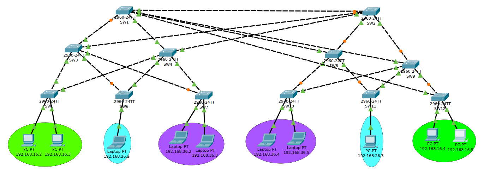
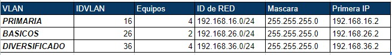
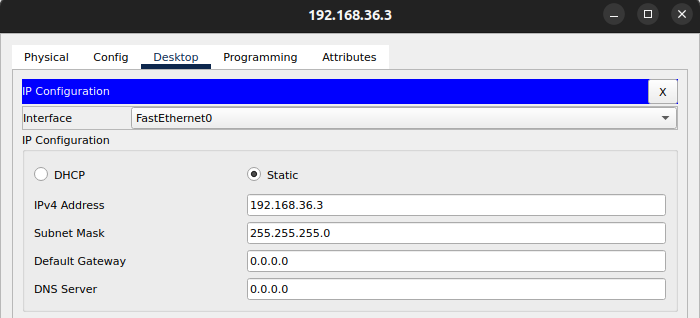
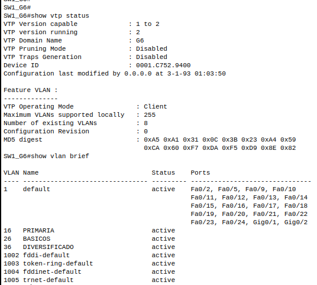
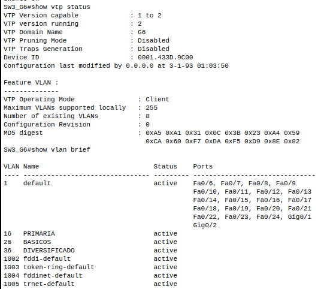
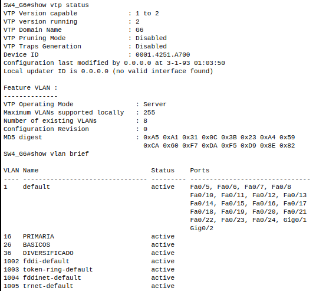
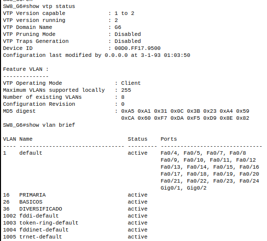
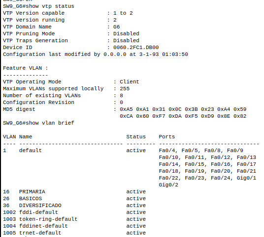
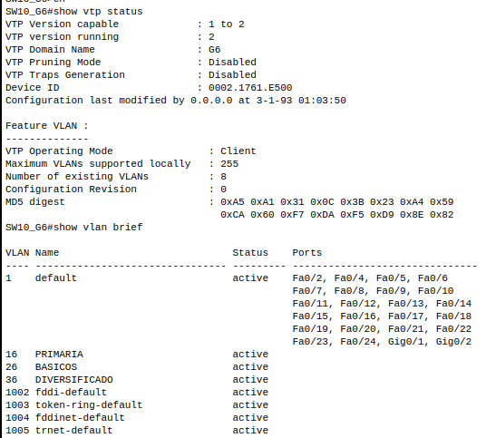
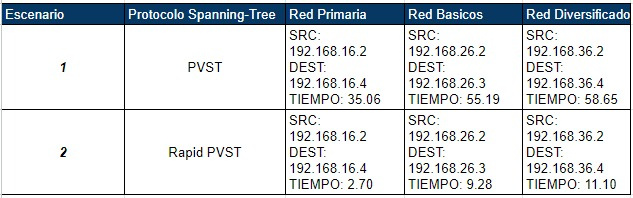

# Practica 1

### Datos Estudiante
| Nombre | Carné |
| ------ | ------ |
| Osmar Abdel Peña Santizo  | 201801619 |
| Vernik Carlos Alexander Yaxón Ortiz | 201712057 |


**<h1 align="center">Topologia</h1>**
	

**<h1 align="center">Direcciones de redes</h1>**
	


### **Configuracion de la PC1**


    
### **Configuracion de la PC2**


### **Configuracion de la PC3**


### **Configuracion de la PC4**


### **Configuracion de la PC5**


### **Configuracion de la PC6**


### **Configuracion de la PC7**


### **Configuracion de la PC8**


### **Configuracion de la PC9**


### **Configuracion de la PC10**


### **Configuracion del Switch SW1**
- Configuracion de hostname
    ``` 
    configure terminal
    hostname SW1_G6
    ```
- Configuracion de interface
    ``` 
    configure termina
    interface fa0/1 
    switchport mode trunk
    switchport nonegotiate
    ```
    Se hizo eso con todas las interfaces conectadas

- Configuracion de vtp 
    ``` 
    configure terminal
    vtp mode client
    vtp domain G6
    vtp password ***********
    do write
    ```
- Resultado
    ``` 
    show vtp status
    show vlan brief
    ``` 
    

### **Configuracion del Switch SW2**
- Configuracion de hostname
    ``` 
    configure terminal
    hostname SW2_G6
    ```
- Configuracion de interface
    ``` 
    configure termina
    interface fa0/1 
    switchport mode trunk
    switchport nonegotiate
    ```
    Se hizo eso con todas las interfaces conectadas
    
- Configuracion de vtp 
    ``` 
    configure terminal
    vtp mode client
    vtp domain G6
    vtp password ***********
    do write
    ```
- Resultado
    ``` 
    show vtp status
    show vlan brief
    ``` 
    


### **Configuracion del Switch SW3**
- Configuracion de hostname
    ``` 
    configure terminal
    hostname SW3_G6
    ```
- Configuracion de interface
    ``` 
    configure termina
    interface fa0/1 
    switchport mode trunk
    switchport nonegotiate
    ```
    Se hizo eso con todas las interfaces conectadas
    
- Configuracion de vtp 
    ``` 
    configure terminal
    vtp mode client
    vtp domain G6
    vtp password ***********
    do write
    ```
- Resultado
    ``` 
    show vtp status
    show vlan brief
    ``` 
    

### **Configuracion del Switch SW4**
- Configuracion de hostname
    ``` 
    configure terminal
    hostname SW4_G6
    ```
- Configuracion de interface
    ``` 
    configure termina
    interface fa0/1 
    switchport mode trunk
    switchport nonegotiate
    ```
    Se hizo eso con todas las interfaces conectadas
    
- Configuracion de vtp 
    ``` 
    configure terminal
    vtp mode client
    vtp domain G6
    vtp password ***********
    do write
    ```
- Resultado
    ``` 
    show vtp status
    show vlan brief
    ``` 
    

### **Configuracion del Switch SW5**
- Configuracion de hostname
    ``` 
    configure terminal
    hostname SW5_G6
    ```
- Configuracion de interface
    ``` 
    configure terminal
    interface fa0/1 
    switchport mode trunk
    switchport nonegotiate
    interface range fa0/11-12
    switchport mode access
    switchport access vlan 16


    configure terminal
    interface fa0/11
    switchport switchport port-security 
    switchport switchport port-security mac-address **MAC*
    interface fa0/12
    switchport switchport port-security 
    switchport switchport port-security mac-address **MAC*
    ```
    Se hizo eso con todas las interfaces conectadas
    
- Configuracion de vtp 
    ``` 
    configure terminal
    vtp mode server
    vtp domain G6
    vtp password ***********
    do write
    ```
- Configuracion de VLANS
     ``` 
    configura terminal
    vlan 16
    name PRIMARIA
    vlan 26
    name BASICOS
    vlan 36
    name DIVERSIFICADO
    ```
- Resultado
    ``` 
    show vtp status
    show vlan brief
    ``` 
    
    
- Configuracion de contraseña
    ``` 
    configure terminal
    line console 0
    password ***********
    login
    end
    ```

### **Configuracion del Switch SW6**
- Configuracion de hostname
    ``` 
    configure terminal
    hostname SW6_G6
    ```
- Configuracion de interface
    ``` 
    configure termina
    interface fa0/1 
    switchport mode trunk
    switchport nonegotiate
    interface fa0/11
    switchport mode access
    switchport access vlan 26
    ```
    Se hizo eso con todas las interfaces conectadas
    
- Configuracion de vtp 
    ``` 
    configure terminal
    vtp mode client
    vtp domain G6
    vtp password ***********
    do write
    ```
- Resultado
    ``` 
    show vtp status
    show vlan brief
    ``` 
    

### **Configuracion del Switch SW7**
- Configuracion de hostname
    ``` 
    configure terminal
    hostname SW7_G6
    ```
- Configuracion de interface
    ``` 
    configure termina
    interface fa0/1 
    switchport mode trunk
    switchport nonegotiate
    interface range fa0/11-12
    switchport mode access
    switchport access vlan 36
    ```
    Se hizo eso con todas las interfaces conectadas
    
- Configuracion de vtp 
    ``` 
    configure terminal
    vtp mode client
    vtp domain G6
    vtp password ***********
    do write
    ```
- Resultado
    ``` 
    show vtp status
    show vlan brief
    ``` 
    

### **Configuracion del Switch SW8**
- Configuracion de hostname
    ``` 
    configure terminal
    hostname SW8_G6
    ```
- Configuracion de interface
    ``` 
    configure termina
    interface fa0/1 
    switchport mode trunk
    switchport nonegotiate
    ```
    Se hizo eso con todas las interfaces conectadas
    
- Configuracion de vtp 
    ``` 
    configure terminal
    vtp mode client
    vtp domain G6
    vtp password ***********
    do write
    ```
- Resultado
    ``` 
    show vtp status
    show vlan brief
    ``` 
    

### **Configuracion del Switch SW9**
- Configuracion de hostname
    ``` 
    configure terminal
    hostname SW9_G6
    ```
- Configuracion de interface
    ``` 
    configure termina
    interface fa0/1 
    switchport mode trunk
    switchport nonegotiate
    ```
    Se hizo eso con todas las interfaces conectadas
    
- Configuracion de vtp 
    ``` 
    configure terminal
    vtp mode client
    vtp domain G6
    vtp password ***********
    do write
    ```
- Resultado
    ``` 
    show vtp status
    show vlan brief
    ``` 
    

### **Configuracion del Switch SW10**
- Configuracion de hostname
    ``` 
    configure terminal
    hostname SW10_G6
    ```
- Configuracion de interface
    ``` 
    configure termina
    interface fa0/1 
    switchport mode trunk
    switchport nonegotiate
    interface range fa0/11-12
    switchport mode access
    switchport access vlan 36
    ```
    Se hizo eso con todas las interfaces conectadas
    
- Configuracion de vtp 
    ``` 
    configure terminal
    vtp mode client
    vtp domain G6
    vtp password ***********
    do write
    ```
- Resultado
    ``` 
    show vtp status
    show vlan brief
    ``` 
    

### **Configuracion del Switch SW11**
- Configuracion de hostname
    ``` 
    configure terminal
    hostname SW11_G6
    ```
- Configuracion de interface
    ``` 
    configure termina
    interface fa0/1 
    switchport mode trunk
    switchport nonegotiate
    interface fa0/11
    switchport mode access
    switchport access vlan 36
    ```
    Se hizo eso con todas las interfaces conectadas
    
- Configuracion de vtp 
    ``` 
    configure terminal
    vtp mode client
    vtp domain G6
    vtp password ***********
    do write
    ```
- Resultado
    ``` 
    show vtp status
    show vlan brief
    ``` 
    

### **Configuracion del Switch SW12**
- Configuracion de hostname
    ``` 
    configure terminal
    hostname SW12_G6
    ```
- Configuracion de interface
    ``` 
    configure termina
    interface fa0/1 
    switchport mode trunk
    switchport nonegotiate
    interface range fa0/11-12
    switchport mode access
    switchport access vlan 16
    ```
    Se hizo eso con todas las interfaces conectadas
    
- Configuracion de vtp 
    ``` 
    configure terminal
    vtp mode client
    vtp domain G6
    vtp password ***********
    do write
    ```
- Resultado
    ``` 
    show vtp status
    show vlan brief
    ``` 
    

### **Prueba de convergencia**
    Se hizo la prueba de convergencia con el modo pvst (default), luego se cambió a rapid-pvst
- ### Cambio a rapid-pvst
    Este comando se ejecutó en todos los switches
    ```
    configure terminal
    spanning-tree mode rapid-pvst
    ```
	
- ### Resultados
	
    
    Optamos por el protocolo rapid-pvst debido a su velocidad de linkeo, ya que es aproximadamente 3 veces más rápido que el modo pvst. Esto nos ayudará a que la red tenga alta disponibilidad.
    

