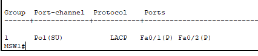
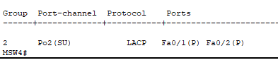
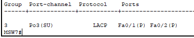
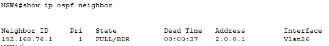
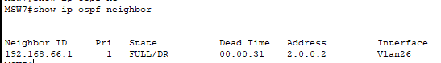
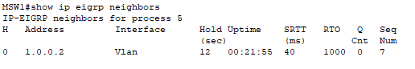
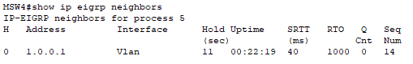

**<h1 align="center">Practica 2 </h1>**
**<h1 align="center"> Grupo 6 </h1>**
<div align="center">

| Nombre | Carné |
| ------ | ------ |
| Osmar Abdel Peña Santizo  | 201801619 |
| Vernik Carlos Alexander Yaxón Ortiz | 201712057 |


</div>


**<h1 align="center">Topologia</h1>**
	

### Configuración MSW1
- Creación de VLANS
``` 
configure terminal
hostname MSW1
vlan 16
name VENTAS
vlan 66
name CORPORATIVO
exit
```
- Agregar la ip a las interfaces vlan
```
int vlan 16
ip address 1.0.0.1 255.0.0.0
no shutdown 
exit
int vlan 66
ip address 192.168.56.1 255.255.255.0
no shutdown 
exit
```
- Activar el ip routing
```
ip routing
```
- Colocar en modo acceso la interfaz g0/1  a su respectiva vlan
``` 
int g0/1
switchport access vlan 16
switchport mode access
description ACC_VLAN16
```
- Configurar EIGRP
```
ip routing
router eigrp 5
network  1.0.0.0 
network 192.168.56.0 
netwokr 192.168.66.0 
exit
```
### Configuración SW1
- Creación de VLANS
``` 
configure terminal
hostname SW1
vlan 66 
name CORPORATIVO
vlan16
name VENTAS
``` 
- Configurar modo acceso para las interfaces de dispositivos finales
``` 
int range f0/11-13
switchport access vlan 66
switchport mode access
``` 
- Configurar las interfaces en modo troncal
``` 
int port 1
switchport mode trunk
```

### Configuración SW2
- Creación de VLANS
``` 
configure terminal
hostname SW2
vlan 66 
name CORPORATIVO
vlan16
name VENTAS
``` 
- Configurar modo acceso para las interfaces de dispositivos finales
``` 
int f0/11
switchport access vlan 66
switchport mode access
``` 
- Configurar las interfaces en modo troncal
``` 
int port 2
switchport mode trunk
```

### Configuración MSW4
- Creación de VLANS
``` 
configure terminal
hostname MSW4
vlan 16
name VENTAS
vlan 66
name CORPORATIVO
vlan 26
name DISTRIBUCION
exit
``` 
- Agregar la ip a las interfaces vlan
``` 
int vlan 16
ip address 1.0.0.2 255.0.0.0
no shutdown 
exit
int vlan 66
ip address 192.168.66.1 255.255.255.0
no shutdown 
exit
int vlan 26
ip address 2.0.0.2 255.0.0.0
no shutdown 
exit
``` 
- Activar el ip routing
``` 
ip routing
``` 
Colocar en modo acceso las interfaces g0/1 y g0/2 a su respectiva vlan
``` 
int g0/1
siwtchport access vlan 16
switchport mode access
description ACC_VLAN16

int g0/2
siwtchport access vlan 26
switchport mode access
description ACC_VLAN26
``` 
- Configuración OSPF
``` 
ip routing
router ospf 6
network  2.0.0.0 0.0.0.255 area 6 
network 192.168.66.0 0.0.0.255 area 6
network 192.168.76.0 0.0.0.255 area 6
exit

do write
``` 
- Configuración EIGRP
``` 
ip routing
router eigrp 5
network  1.0.0.0 
network 192.168.56.0 
netwokr 192.168.66.0 
exit
```

### Configuración SW3
- Creación de VLANS
``` 
configure terminal
hostname SW3
vlan 66 
name CORPORATIVO
vlan 26
name DISTRIBUCION
``` 
- Configurar modo acceso para las interfaces de dispositivos finales
``` 
int range f0/11-12
switchport access vlan 66
switchport mode access
``` 
- Configurar las interfaces en modo troncal
``` 
int port 3
switchport mode trunk
```
### Configuración MSW7
- Creación de VLANS
``` 
configure terminal
hostname MSW7
vlan 66
name CORPORATIVO
vlan 26
name DISTRIBUCION
exit
``` 
- Agregar la ip a las interfaces vlan
``` 
int vlan 66
ip address 192.168.76.1 255.255.255.0
no shutdown 
exit
int vlan 26
ip address 2.0.0.1 255.0.0.0
no shutdown 
exit
``` 
- Activar el ip routing
``` 
ip routing
``` 
- Colocar en modo acceso las interfaz g0/2 a su respectiva vlan
``` 
int g0/2
switchport access vlan 26
switchport mode access
description ACC_VLAN26
``` 
- Configuración OSPF
``` 

ip routing
router ospf 6
network  2.0.0.0 0.0.0.255 area 6 
network 192.168.66.0 0.0.0.255 area 6
netwokr 192.168.76.0 0.0.0.255 area 6
exit

```


### Configuración LACP 
- ## Configuración SW1 - MSW1
    SW1
     ``` 
    configure terminal
    interface range f0/1-2
    channel-protocol lacp
    channel-group 1 mode active
    no shutdown
    ```
    MSW1
    ``` 
    configure terminal
    interface range f0/1-2
    channel-protocol lacp
    channel-group 1 mode passive
    no shutdown 
    ```
- ## Configuración SW2 - MSW4
    SW2
     ``` 
    configure terminal
    interface range f0/1-2
    channel-protocol lacp
    channel-group 2 mode active
    no shutdown
    ```
    MSW4
    ``` 
    configure terminal
    interface range f0/1-2
    channel-protocol lacp
    channel-group 2 mode passive
    no shutdown 
    ```
- ## Configuración SW3 - MSW7
    SW3
     ``` 
    configure terminal
    interface range f0/1-2
    channel-protocol lacp
    channel-group 3 mode active
    no shutdown
    ```
    MSW7
    ``` 
    configure terminal
    interface range f0/1-2
    channel-protocol lacp
    channel-group 3 mode passive
    no shutdown 
    ```


### **Configuracion de la PC1**


    
### **Configuracion de la PC2**


### **Configuracion de la PC3**


### **Configuracion de la PC4**


### **Configuracion de la PC5**


### **Configuracion de la PC6**


### **Etherchannel Summary**

``` 
show etherchannel summary
``` 
- MSW1

    
- MSW4

    
- MSW7

    

### **OSPF Neighbors**
``` 
show ip ospf neighbor
``` 
- MSW4

    
- MSW7

    

### **EIGRP Neighbors**
``` 
show ip eigrp neighbors
``` 
- MSW1

    
- MSW4

    


    

