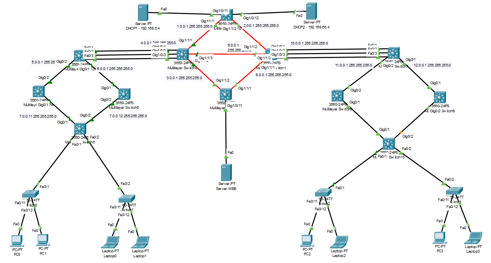
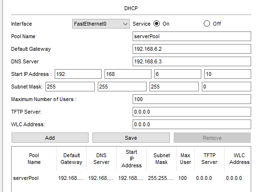
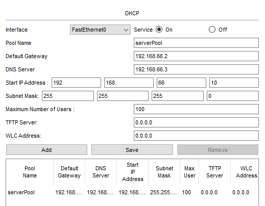
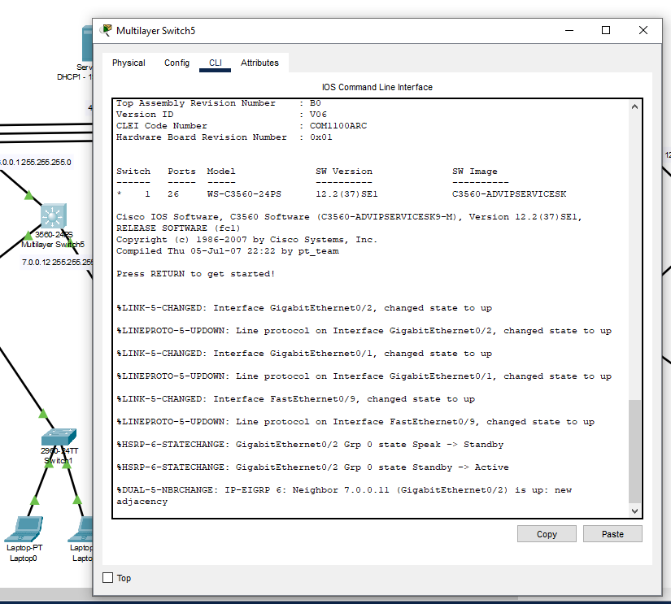
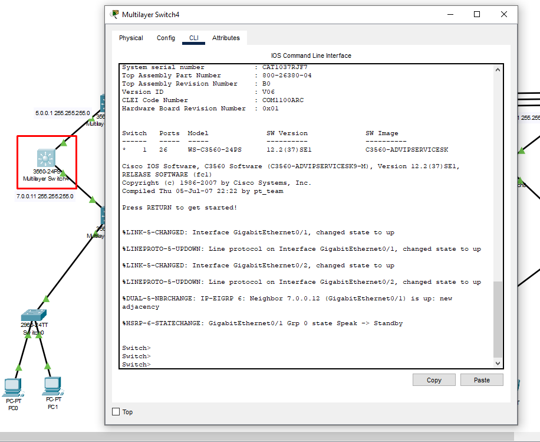

**<h1 align="center">Proyecto 1</h1>**
**<h1 align="center"> Grupo 6 </h1>**
<div align="center">

| Nombre | Carné |
| ------ | ------ |
| Osmar Abdel Peña Santizo  | 201801619 |
| Vernik Carlos Alexander Yaxón Ortiz | 201712057 |


</div>


**<h1 align="center">Topologia</h1>**
	

### Configuración Server DHCP1



### Configuración Server DHCP2



### Configuración MSW2
``` 
configure terminal
hostname MSW2

int g1/0/11
switchport mode access
switchport access vlan 16

int g1/0/12
switchport mode access
switchport access vlan 26

int g1/1/1
switchport mode trunk

int g1/1/2
switchport mode trunk

``` 

- Creación de VLANS
``` 
configure terminal
hostname MSW1
vlan 16
name ANDROMEDA
vlan 66
name MILKYWAY
exit
```

- Configuración de VTP
``` 
configure terminal
vtp mode server
vtp domain G6
vtp password *********
do write
```
- Agregar la ip a las interfaces vlan
```
int vlan 1
ip address 1.0.0.1 255.255.255.0
int vlan 2
ip address 2.0.0.2 255.255.255.0
int vlan 16
ip address 192.168.6.5 255.255.255.0
int vlan 26
ip address 192.168.66.5 255.255.255.0
```

- Configuración EIGRP
```
ip routing
router eigrp 6
network 1.0.0.0 0.0.0.255
network 2.0.0.0 0.0.0.255
network  192.168.6.0
network 192.168.66.0 
```

### Configuración MSW0
- Configuración de LAPC
``` 
configure terminal
hostname MSW0

int g1/0/1
switchport mode trunk
channel-protocol lacp
channel-group 1 mode active

int g1/0/2
switchport mode trunk
channel-protocol lacp
channel-group 1 mode active

int g1/0/3
switchport mode trunk
channel-protocol lacp
channel-group 1 mode active

int g1/1/2
switchport mode trunk

int g1/1/3
switchport mode trunk
``` 
- Configuración de VTP
``` 
configure terminal
vtp mode client
vtp domain G6
vtp password *********
do write
``` 

- Agregar la ip a las interfaces vlan
```
int vlan 1
ip address 1.0.0.2 255.255.255.0
int vlan 3
ip address 3.0.0.1 255.255.255.0
int vlan 4
ip address 4.0.0.1 255.255.255.0
int vlan 9
ip address 9.0.0.2 255.255.255.0
```

- Configuración EIGRP
```
ip routing
router eigrp 6
network  1.0.0.0 0.0.0.255
network  3.0.0.0 0.0.0.255
network  4.0.0.0 0.0.0.255
network  9.0.0.0 0.0.0.255
auto-summary
```

### Configuración MSW11
``` 
configure terminal
hostname MSW11

int g1/0/11
switchport access vlan 16
switchport mode access 

int g1/1/1
switchport mode trunk

int g1/1/2
switchport mode trunk
``` 
- Configuración de VTP
``` 
configure terminal
vtp mode client
vtp domain G6
vtp password *********
do write
``` 
- Agregar la ip a las interfaces vlan
```
int vlan 3
ip address 3.0.0.2 255.255.255.0
```

- Configuración EIGRP
```
ip routing
router eigrp 6
network  3.0.0.0 0.0.0.255
```

### Configuración MSW3
- Configuración de LAPC
``` 
configure terminal
hostname MSW3

int f0/1
switchport mode trunk
channel-protocol lacp
channel-group 1 mode passive

int f0/2
switchport mode trunk
channel-protocol lacp
channel-group 1 mode passive

int f0/3
switchport mode trunk
channel-protocol lacp
channel-group 1 mode passive

int g0/1
switchport trunk enkcapsulation dot1q
switchport mode trunk

int g0/2
switchport trunk enkcapsulation dot1q
switchport mode trunk
``` 
- Configuración de VTP
``` 
configure terminal
vtp mode client
vtp domain G6
vtp password *********
do write
``` 

### Configuración MSW7
- Configuración de LAPC
``` 
configure terminal
hostname MSW7

int f0/1
switchport trunk encapsulation dot1q
switchport mode trunk
channel-protocol lacp
channel-group 1 mode passive

int f0/2
switchport trunk encapsulation dot1q
switchport mode trunk
channel-protocol lacp
channel-group 1 mode passive

int f0/3
switchport trunk encapsulation dot1q
switchport mode trunk
channel-protocol lacp
channel-group 1 mode passive

int g0/1
switchport trunk enkcapsulation dot1q
switchport mode trunk

int g0/2
switchport trunk enkcapsulation dot1q
switchport mode trunk
``` 
- Configuración de VTP
``` 
configure terminal
vtp mode client
vtp domain G6
vtp password *********
do write
``` 

- Agregar la ip a las interfaces vlan
```
int vlan 10
ip address 10.0.0.2 255.255.255.0
int vlan 11
ip address 11.0.0.1 255.255.255.0
int vlan 12
ip address 12.0.0.1 255.255.255.0
```

- Configuración EIGRP
```
ip routing
router eigrp 6
network  10.0.0.0 0.0.0.255
network  11.0.0.0 0.0.0.255
network  12.0.0.0 0.0.0.255
```

### Configuración MSW1
- Configuración de LAPC
``` 
configure terminal
hostname MSW1

int g1/0/1
switchport mode trunk
channel-protocol lacp
channel-group 1 mode active

int g1/0/2
switchport mode trunk
channel-protocol lacp
channel-group 1 mode active

int g1/0/3
switchport mode trunk
channel-protocol lacp
channel-group 1 mode active

int g1/1/1
switchport mode trunk

int g1/1/2
switchport mode trunk

int g1/1/3
switchport mode trunk

``` 
- Configuración de VTP
``` 
configure terminal
vtp mode client
vtp domain G6
vtp password *********
do write
``` 

- Agregar la ip a las interfaces vlan
```
int vlan 2
ip address 2.0.0.2 255.255.255.0
int vlan 8
ip address 8.0.0.1 255.255.255.0
int vlan 9
ip address 9.0.0.1 255.255.255.0
int vlan 10
ip address 10.0.0.1 255.255.255.0
```

- Configuración EIGRP
```
ip routing
router eigrp 6
network  2.0.0.0 0.0.0.255
network  8.0.0.0 0.0.0.255
network  9.0.0.0 0.0.0.255
network  10.0.0.0 0.0.0.255
```

### Configuración MSW4

``` 
configure terminal
hostname MSW4
int g0/1
switchport trunk encapsulation dot1q
switchport mode trunk
int g0/2
switchport trunk encapsulation dot1q
switchport mode trunk
``` 
- Configuración de VTP
``` 
configure terminal
vtp mode client
vtp domain G6
vtp password *********
do write
``` 

### Configuración MSW5

``` 
configure terminal
hostname MSW5
int g0/1
switchport trunk encapsulation dot1q
switchport mode trunk
int g0/2
switchport trunk encapsulation dot1q
switchport mode trunk
``` 
- Configuración de VTP
``` 
configure terminal
vtp mode client
vtp domain G6
vtp password *********
do write
``` 

### Configuración MSW6

``` 
configure terminal
hostname MSW6
int fa0/1
switchport access vlan 16
switchport trunk encapsulation dot1q
switchport mode trunk
int fa0/2
switchport access vlan 26
switchport trunk encapsulation dot1q
switchport mode trunk
int g0/1
switchport trunk encapsulation dot1q
switchport mode trunk
int g0/2
switchport trunk encapsulation dot1q
switchport mode trunk
``` 
- Configuración de VTP
``` 
configure terminal
vtp mode client
vtp domain G6
vtp password *********
do write
``` 
- Agregar la ip a las interfaces vlan
```
int vlan 16
ip address 192.168.6.5 255.255.255.0
int vlan 26
ip address 192.168.66.5 255.255.255.0
```

### Configuración SW0

``` 
configure terminal
hostname SW0
int fa0/1
switchport mode trunk
int fa0/11
switchport access vlan 16
switchport mode access 
int fa0/12
switchport access vlan 16
switchport mode access 

``` 
- Configuración de VTP
``` 
configure terminal
vtp mode client
vtp domain G6
vtp password *********
do write
``` 


### Configuración SW1

``` 
configure terminal
hostname SW0
int fa0/2
switchport mode trunk
int fa0/11
switchport access vlan 26
switchport mode access 
int fa0/12
switchport access vlan 26
switchport mode access 

``` 
- Configuración de VTP
``` 
configure terminal
vtp mode client
vtp domain G6
vtp password *********
do write
``` 

### Configuración MSW8

``` 
configure terminal
hostname MSW8
int g0/1
switchport trunk encapsulation dot1q
switchport mode trunk
int g0/2
switchport trunk encapsulation dot1q
switchport mode trunk
``` 
- Configuración de VTP
``` 
configure terminal
vtp mode client
vtp domain G6
vtp password *********
do write
``` 

### Configuración MSW9

``` 
configure terminal
hostname MSW9
int g0/1
switchport trunk encapsulation dot1q
switchport mode trunk
int g0/2
switchport trunk encapsulation dot1q
switchport mode trunk
``` 
- Configuración de VTP
``` 
configure terminal
vtp mode client
vtp domain G6
vtp password *********
do write
``` 
### Configuración MSW9

``` 
configure terminal
hostname MSW9
int g0/1
switchport trunk encapsulation dot1q
switchport mode trunk
int g0/2
switchport trunk encapsulation dot1q
switchport mode trunk
``` 
- Configuración de VTP
``` 
configure terminal
vtp mode client
vtp domain G6
vtp password *********
do write
``` 

### Configuración MSW10

``` 
configure terminal
hostname MSW10
int fa0/1
switchport trunk encapsulation dot1q
switchport mode trunk
int fa0/2
switchport trunk encapsulation dot1q
switchport mode trunk
``` 
- Configuración de VTP
``` 
configure terminal
vtp mode client
vtp domain G6
vtp password *********
do write
``` 

### Configuración SW2

``` 
configure terminal
hostname SW2
int fa0/1
switchport mode trunk
int fa0/11
switchport access vlan 16
switchport mode access 
int fa0/12
switchport access vlan 16
switchport mode access 

``` 
- Configuración de VTP
``` 
configure terminal
vtp mode client
vtp domain G6
vtp password *********
do write
``` 


### Configuración SW3

``` 
configure terminal
hostname SW3
int fa0/2
switchport mode trunk
int fa0/11
switchport access vlan 26
switchport mode access 
int fa0/12
switchport access vlan 26
switchport mode access 

``` 
- Configuración de VTP
``` 
configure terminal
vtp mode client
vtp domain G6
vtp password *********
do write
``` 

### Configuración HSRP
- ## Configuración MSW4 - MSW5
    MSW4
     ``` 
    int g0/1
    no switchport 
    ip address 192.168.96.12 255.255.255.0
    duplex auto
    speed auto
    standby  0 ip 192.168.96.11
    standby priority 10
    standby preempt
    ```
    MSW5
    ``` 
    int g0/2
    no switchport 
    ip address 192.168.96.13 255.255.255.0
    duplex auto
    speed auto
    standby  0 ip 192.168.96.11
    standby priority 10
    standby preempt
    ```
- ## Configuración MSW8 - MSW9
    MSW8
     ``` 
    int g0/1
    no switchport 
    ip address 192.168.86.12 255.255.255.0
    duplex auto
    speed auto
    standby  0 ip 192.168.86.11
    standby priority 10
    standby preempt
    ```
    MSW9
    ``` 
    int g0/2
    no switchport 
    ip address 192.168.86.13 255.255.255.0
    duplex auto
    speed auto
    standby  0 ip 192.168.86.11
    standby priority 10
    standby preempt
    ```
- ## Configuración SW3 - MSW7
    SW3
     ``` 
    configure terminal
    interface range f0/1-2
    channel-protocol lacp
    channel-group 3 mode active
    no shutdown
    ```
    MSW7
    ``` 
    configure terminal
    interface range f0/1-2
    channel-protocol lacp
    channel-group 3 mode passive
    no shutdown 
    ```


### **Capturas de HSRP**
- Active

    
- Standby



    

