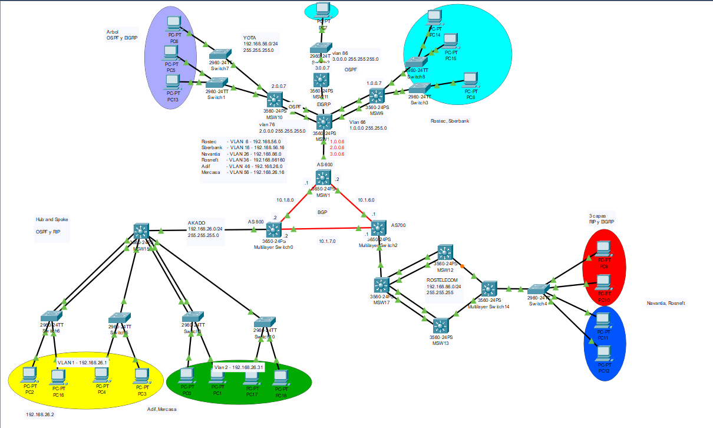

**<h1 align="center">Proyecto 1</h1>**
**<h1 align="center"> Grupo 6 </h1>**
<div align="center">

| Nombre | Carné |
| ------ | ------ |
| Osmar Abdel Peña Santizo  | 201801619 |
| Vernik Carlos Alexander Yaxón Ortiz | 201712057 |


</div>


**<h1 align="center">Topologia</h1>**
	

### Red YOTA
<div align="center">


</div>


### Red ROSTELECOM
<div align="center">


</div>

### Red AKADO
<div align="center">


</div>

### Tabla de Subneting
<div align="center">


</div>

### Configuración MSW0
- Configuración de BGP
``` 
configure terminal
hostname MSW0

ip routing
router bgp 800
network 10.1.8.0 255.255.255.252
network 10.1.7.0 255.255.255.252
network 192.168.26.0 255.255.255.0

int g1/1/1
no switchport 
ip address 10.1.8.2 255.255.255.252

int g1/1/2
no switchport 
ip address 10.1.7.2 255.255.255.252

router bgp 700 
neighbor 10.1.8.1 remote-as 600
neighbor 10.1.7.1 remote-as 700

``` 
### Configuración MSW1
- Configuración de BGP
``` 
configure terminal
hostname MSW1

ip routing
router bgp 600
network 10.1.8.0 255.255.255.252
network 10.1.6.0 255.255.255.252
network 192.168.56.0 255.255.255.0

int g1/1/1
no switchport 
ip address 10.1.8.1 255.255.255.252

int g1/1/2
no switchport 
ip address 10.1.6.2 255.255.255.252

router bgp 700 
neighbor 10.1.8.2 remote-as 800
neighbor 10.1.6.1 remote-as 700

``` 

### Configuración MSW2
- Configuración de BGP
``` 
configure terminal
hostname MSW2

ip routing
router bgp 700
network 10.1.6.0 255.255.255.252
network 10.1.7.0 255.255.255.252
network 192.168.86.0 255.255.255.0

int g1/1/1
no switchport 
ip address 10.1.7.1 255.255.255.252

int g1/1/2
no switchport 
ip address 10.1.6.1 255.255.255.252

router bgp 700 
neighbor 10.1.6.2 remote-as 600
neighbor 10.1.7.2 remote-as 800

``` 

### Configuración MSW10
- Configuración de LAPC
``` 
configure terminal
hostname MSW10

int fa0/4
switchport mode trunk
channel-protocol lacp
channel-group 1 mode pasive

int fa0/2
switchport mode trunk
channel-protocol lacp
channel-group 1 mode pasive

``` 

### Configuración MSW16
- Configuración de LAPC
``` 
configure terminal
hostname MSW16

int fa0/2
switchport mode trunk
channel-protocol lacp
channel-group 1 mode active

int fa0/4
switchport mode trunk
channel-protocol lacp
channel-group 1 mode active

int range fa0/5-6
switchport mode trunk
channel-protocol lacp
channel-group 2 mode active

vlan 6 
name ROSTEC
vlan 16
name SBERBANK
vlan 76
name PASO76
vlan 66
name PASO66
vlan 86
name PASO86

int vlan 6
ip address 192.168.56.1 255.255.255.248
no shutdown

int vlan 16
ip address 192.168.56.17 255.255.255.248

int vlan 76
ip address 2.0.0.6 255.0.0.0

int vlan 66
ip adress 1.0.0.6 255.0.0.0

int vlan 86
ip address 3.0.0.6 255.0.0.0

``` 

### Configuración MSW9
- Configuración de LAPC
``` 
configure terminal
hostname MSW9

int range fa0/5-6
switchport mode trunk
channel-protocol lacp
channel-group 2 mode passive

vlan 6 
name ROSTEC
vlan 16
name SBERBANK
vlan 76
name PASO76
vlan 66
name PASO66
vlan 86
name PASO86

int vlan 6
ip address 192.168.56.1 255.255.255.248
no shutdown

int vlan 16
ip address 192.168.56.17 255.255.255.248

int vlan 76
ip address 2.0.0.7 255.0.0.0

int vlan 66
ip adress 1.0.0.7 255.0.0.0

int vlan 86
ip address 3.0.0.7 255.0.0.0


``` 

### Configuración MSW15
- Configuración de LAPC
``` 
configure terminal
hostname MSW15

int range fa0/1-2
switchport mode trunk
channel-protocol lacp
channel-group 3 mode active

int range fa0/3-4
switchport mode trunk
channel-protocol lacp
channel-group 4 mode active
``` 

### Configuración MSW5
- Configuración de LAPC
``` 
configure terminal
hostname MSW5

int range fa0/2-3
switchport mode trunk
channel-protocol lacp
channel-group 3 mode passive


``` 
### Configuración MSW7
- Configuración de LAPC
``` 
configure terminal
hostname MSW7

int range fa0/4-5
switchport mode trunk
channel-protocol lacp
channel-group 4 mode passive
``` 

### Configuración MSW17
- Configuración de LAPC
``` 
configure terminal
hostname MSW17

int range fa0/2-3
switchport mode trunk
channel-protocol lacp
channel-group 5 mode active

int range fa0/4-6
switchport mode trunk
channel-protocol lacp
channel-group 5 mode active
``` 

### Configuración MSW12
- Configuración de LAPC
``` 
configure terminal
hostname MSW12

int range fa0/2-3
switchport mode trunk
channel-protocol lacp
channel-group 5 mode active
``` 

### Configuración MSW13
- Configuración de LAPC
``` 
configure terminal
hostname MSW13

int range fa0/4-5
switchport mode trunk
channel-protocol lacp
channel-group 6 mode active

``` 


### Configuración SW6
- Configuración de LAPC
``` 
configure terminal
hostname SW6

int range fa0/1-2
switchport mode trunk
channel-protocol lacp
channel-group 3 mode passive

``` 


### Configuración SW0
- Configuración de LAPC
``` 
configure terminal
hostname SW0

int range fa0/3-4
switchport mode trunk
channel-protocol lacp
channel-group 4 mode passive

``` 


